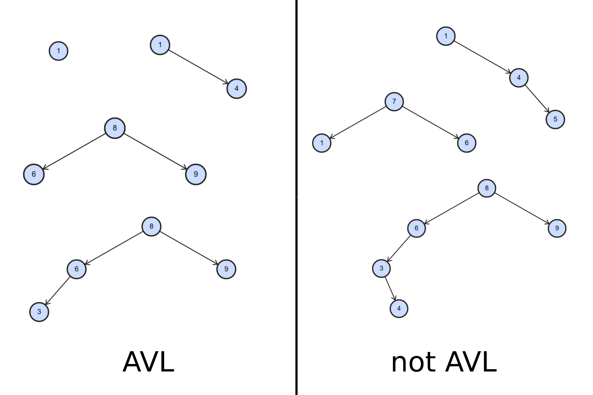
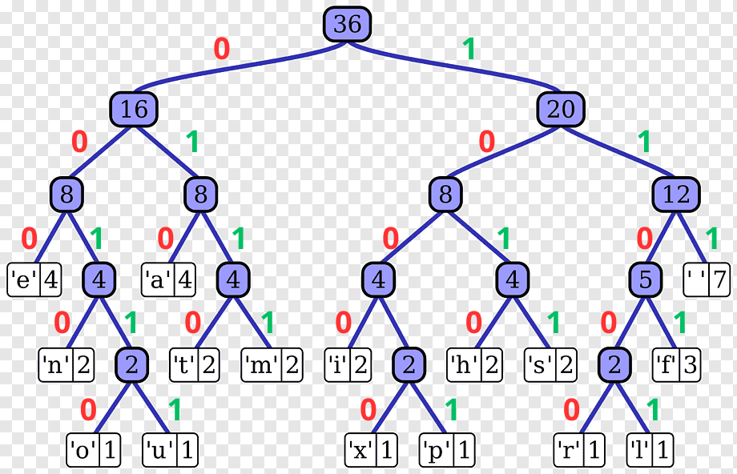
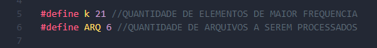
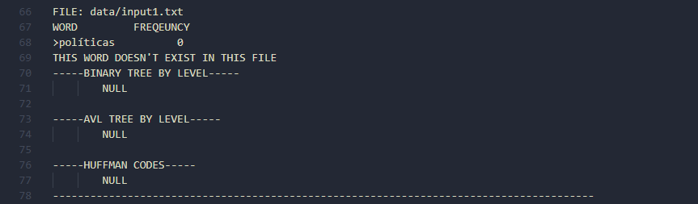
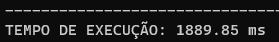

<h1 align="center" font-size="200em"><b> Sugestao De Palavras </b></h1>

<!-- imagem -->

 
## 💻Objetivos
Este é um programa desenvolvido em C++ para a disciplina de Algoritmos e Estruturas de Dados II, proposta pelo professor [Michel Pires](https://github.com/mpiress)  
O objetivo desta atividade consiste em verificar a existencia de uma palavra digitada pelo usuario em determinado texto e apartir dela criar uma árvore binaria, AVL e uma codificação Huffman, deve-se entao criar um sistema que possibilite a funcionalidade de oferecer sugestões de palavras aos usuários.
Sendo assim ao final dessa atividade teremos um algoritmo que realiza as operações:
- [✔️] De busca de uma palavra em textos
- [✔️] Seleciona as K palavras mais frequentes presente e cada texto e lhe da de sugestão 
- [✔️] Realiza a montagem de arvores binárias, AVL e codificação de Huffman

Neste programa foi feita a utlização de bibliotecas como `<unordered_map>` que é estrutura propria da linguagem C++ que serve para a utilização da montagem da tabela hash, sendo possivel mais informações sobre essa biblioteca clicando no link a seguir: [<unordered_map>](https://cplusplus.com/reference/unordered_map/unordered_map/)  
Foi utlizado tambem expressões regulares como `<regex>` e para a manipulação dos textos lidos, mais informações de sua utlização e seu funcionamento basta acessar o link a seguir: [<regex>](https://cplusplus.com/reference/regex/basic_regex/) 

## ✒️Introdução

<h4><em>Oque é uma arvore na programação</em></h4> Uma árvore é uma forma de organizar informações em que os dados estão organizados de cima para baixo, como ramos de uma árvore, ao contrário de uma lista onde os dados estão em uma linha reta, nas árvores os dados estão dispostos de forma hierárquica.

<h4><em>Caracteristicas de uma arvore</em></h4>

<li> Raiz: Toda arvore possui o nó raiz que é o nó inicial da árvore;</li>
<li> Grau: o número de filhos que um nó possui; </li>
<li> Nível (ou profundidade): a distância de um nó até a raiz;</li>
<li> Altura: o maior nível encontrado na árvore (altura de uma árvore com n nós pode variar de lg(n) até n-1);</li>
<li> Folha: o nó que não possui filho;</li>
<li> O numero maior que o atual vai para a direita, o menor que o no atual vai para a esquerda, sendo assim possivel as funções de inserção, remoção e procura</li>

A partir disso é possivel implementar varias tipos de arvores, como a AVL, a binária a Red-Black-Tree, mas tendo suas mudanças cada uma.

  
  
<em> AVL e binária </em>

<h4><em>Codificação de Huffman</em></h4>
Uma árvore de Huffman é uma estrutura binária na qual cada nó interno possui exatamente dois filhos. Importante notar que as árvores de Huffman não consideram a relação de ordem (esquerda ou direita) entre os filhos de um nó. 
Uma árvore binária completa, conhecida como árvore de Huffman, é construída de forma recursiva combinando os dois símbolos de menor probabilidade. Esses símbolos, os utilizados nesse trabalho foi o simbolo de vazio: '/0', são agrupados em novamente com o restante dos simbolos. Esse processo é repetido até que todos os símbolos tenham sido agrupados em símbolos auxiliares, formando assim uma árvore binária. Posteriormente, a árvore é percorrida e valores binários, 1 ou 0, são atribuídos a cada aresta. Os códigos são então gerados com base nesse percurso, sendo o 0 a ida para a esquerda e 1 a ida para a direita.

  
  
<em> Exemplificação do codigo Huffman </em>

## 📄Arquivos
- <strong>Main.cpp:</strong> Chamada das funções de leitura e processamento dos textos, aberto um arquivo por vez e realizado seus dados para cada palavra, tempo de execução do código e a limpeza das variaveis.
- <strong>header.cpp:</strong> Inclusão das bibliotecas e arquivos utilizados.
- <strong>functions.hpp:</strong> Declaração das funções.
- <strong>functions.cpp:</strong> Desenvolvimento das funções. 
- <strong>data/input.data:</strong> Lista de palavras que se deseja procurar e realizar o interpretação.
- <strong>data/input.txt</strong> Textos a serem lidos no programa.
- <strong>data/stopwords.txt:</strong> Stop words, como por exemplo, para artigo (a, o, as,os) e para conjunções (e, ou), serão palvras que não seram lidas e processadas no texto.

## 🧠Lógica adotada

Nesse programa foi utilizado uma atividade ja realizada anteriormente, a atividade Top K Itens presente nesse perfil, nela tinhamos que pegar as K palavras mais frequentes de um texto e com isso exibir ao usuário a montagem de um heap tendo como filhos as posições 2*i+1 e 2*i+2, mais informações sobre essa atividade e como foi feita as implementações e seu funcionamaento basta clicar no link a seguir: [Top K Itens](https://github.com/JulliaFernandes/TopKItens).   
Tendo uma parte ja feita foi necessario somente complementar com as funções das criações das arvores.

Buscando uma melhora significativa de tempo foi utlizado a abordagem de fazer a leitura de todas as palavras por arquivo, dessa maneira a cada arquivo de texto aberto é visto se a lista de palavras selecionadas pelo usuario esta presente no texto, se em caso afirmativo é realizado a montagem da arvore das K palavras mais frequentes e realizado a montagem de cada árvore necessaria para a aplicação dessa atividade e a codificação de huffman, importante ressaltar que se a palavra procurada estiver presente no texto e tambem ser uma das palavras mais frequentes no texto, ou seja estará no heap,  é necessario exclui-la de la e colocar a proxima palavra mais frequente.

🚨 <b>INFORMAÇÕES IMPORTANTES</b> 🚨  
- É importante que o usuário especifique a quantidade desejada de palavras de sugestão, que está localizada na linha (5) do arquivo `main.cpp`. A quantidade desejada deve ser um item a mais; por exemplo, se desejar as 10 palavras mais frequentes, você deve configurar a quantidade como 11. Durante a execução do código, haverá manipulação para excluir uma palavra e, ao final, o programa apresentará ao usuário apenas as 10 palavras mais frequentes.
- Certifique-se de nomear os arquivos no formato "input1.txt", "input2.txt" e assim por diante para garantir o funcionamento correto do código. Também é necessário incluir a quantidade de arquivos a serem lidos na linha (6) do arquivo `main.cpp`.

  

  
  
<em> Variaveis das K palavras e quantidade de arquivos </em>

 
## 🔨 Funções
A função principal desse algoritmo é a: 
- `fillheap()`: abordamos a lógica de criar um heap com as K palavras mais frequentes. Como mencionado anteriormente, o usuário precisa especificar a quantidade desejada com um item a mais. Nessa função, verificamos se a palavra procurada está presente no heap. Se estiver, ela é removida, e a estrutura do heap é reorganizada para manter a quantidade desejada pelo usuário. Se a palavra não estiver no heap, apenas o primeiro item (com a menor frequência) é excluído, e o heap é ajustado para garantir que os filhos sejam maiores que o pai. 
Após essa etapa, com o heap devidamente configurado, chamamos as funções de inserção para as árvores AVL e binária, além de criar a árvore de Huffman. Em seguida, a função responsável por colocar as informações coletadas de uma palavra no output é chamada, seguida pela limpeza das variáveis usadas para garantir o funcionamento adequado na próxima palavra. 
Esse processo é repetido até que todas as palavras escolhidas pelo usuário sejam processadas no texto em questão. Somente então podemos avançar para o próximo texto.

Outras funções importantes para o funcionamento do código são: 
- `buildBinaryTree()`: função que tem o objetivo de criar a arvore binária.
- `insertTree()`: função de criação da árvore AVL.
- `HuffmanTree()`: função de criação da árvore de Huffman.
- `HuffmanCode()`: função criada no intuito de salvar os códigos formados de cada palavra da arvore de Huffman.
- `buildHuffmanCodes()`: função criada para a construção dos codigos na arvore de Huffman.
- `outputFile()`: função para escrever no arquivo de saida.
- `creatHeap()`: função de criação do heap e das K palavras mais frequentes.

## 🗂️ Estruturas utilizadas

Alem das estruturas utilizadas pela atividade [Top K Itens](https://github.com/JulliaFernandes/TopKItens) foi implementado a mais a função de <priority_queue> para a montagem da arvore de huffman.

<h2>Priority_queue</h2>

Em resumo, a <priority_queue> em C++ é uma estrutura de dados que permite organizar elementos de acordo com sua prioridade, com base em um heap binário subjacente, tornando fácil e eficiente o acesso ao elemento de maior prioridade. Sua implementação interna é abstraída para o usuário, facilitando o uso dessa estrutura em algoritmos e aplicações que requerem ordenação por prioridade.

  
  
<em> Exemplificação ddo priority-queue </em>

  
Após compreendermos a estrutura de uma árvore binária e seus conceitos básicos, a implementação da árvore AVL exigiu a introdução de funções adicionais. O funcionamento geral de uma árvore AVL segue a mesma lógica de uma árvore binária, mas se diferencia devido aos constantes balanceamentos que ocorrem. Para lidar com isso, foram criadas funções cruciais, incluindo:

- `rebalanceTree`: Responsável por reequilibrar a árvore quando necessário.
- `getWeight`: Usada para calcular o peso de um nó.
- `getMaxWeight`: Utilizada para determinar o peso máximo de um nó.
- `rotacaoSimplesDireita`: Realiza uma rotação simples para a direita.
- `rotacaoSimplesEsquerda`: Executa uma rotação simples para a esquerda.
- `rotacaoDuplaDireita`: Realiza uma rotação dupla para a direita.
- `rotacaoDuplaEsquerda`: Realiza uma rotação dupla para a esquerda. 

Essas funções desempenham um papel essencial na manutenção do balanceamento da árvore AVL, especialmente quando um nó atinge uma altura de 2.

No que diz respeito ao código Huffman, a árvore é montada progressivamente. A ideia por trás do código Huffman envolve adicionar todos os elementos do heap a uma priority_queue, organizando-os em ordem crescente. Em seguida, os dois primeiros elementos da fila de prioridades são combinados em um novo nó, um se tornando o filho direito e o outro o filho esquerdo. Esse processo é repetido até que reste apenas um elemento na fila, sinalizando a conclusão da árvore de Huffman. 
É importante observar que no código Huffman, as palavras mais frequentes têm códigos menores e estão localizadas mais próximas do topo da árvore. Além disso, a construção da árvore de Huffman segue a lógica "bottom-up", ou seja, começa com os elementos menores e cria a árvore de forma ascendente. Isso garante que as palavras mais comuns sejam representadas por códigos mais curtos, economizando espaço na representação do texto. 
Para criar os códigos, seguimos uma lógica simples:

- Ao percorrer à esquerda em direção a um nó, atribuímos o número 0.
- Ao percorrer à direita em direção a um nó, atribuímos o número 1. 
Esse processo de atribuição de códigos é repetido até chegarmos a um nó folha, que corresponderá a uma palavra específica no texto. Dessa forma, cada palavra terá um código único baseado em sua posição na árvore de Huffman. 

## 🕗 Tempo:
Os tempos obtidos foram em nanosegundos visto que sua implementação se deu muito rapida, com isso foi possivel obter o valor de numero para a montagem das arvores AVL, binarias e codigo huffman, a que apresentou melhores resultados foi a arovre binaria com um tempo medio de : XXXXX, esse tempo foi medido atraves de 10 compilações do programa, o motivo de ela ter sido mais rapida de todas esta diretamente ligado ao fato da forma como os dados estão sendo inseridos visto que a arovre binaria se encontra muito desequilibrada e não realiza rotações, por mais que a AVL tenha gasto nanosegundos a mais sua eficiencia é garantida principalmnte nas operações de busca remoção, algo que pela binaria não ocorre muito bem. O codigo huffman foi o mais demorado em relação aos outros e isso se da tambem devido a como é realizado sua montagem, levando à uma piora no quesito tempo.

## RESULTADOS E ANÁLISE
Antes de procedermos com qualquer análise, é crucial ter em mente que os resultados dos testes podem variar consideravelmente dependendo das máquinas em que o programa é executado. Conforme a intuição sugere, máquinas mais poderosas tendem a produzir resultados superiores.
Os resultados mostrados nessa seção são retirados dos textos que ja se encontram na pasta `data`.
O formato de saída dos textos no arquivo `output.data` são realizados da seguinte maneira: 
- Mostrado o texto em que se encontra atualmente
- A palavra que esta sendo lida no momento e sua respectiva frequencia no texto em questão
- A construção da árvore binária, sendo feita de forma crescente de frequencia.
- A construção da árvore AVL e tambem sendo impressa na ordem crescente de frequencia.
- Codificação de huffman com a palavra e seu respectivo código formado e é impresso de maneira crescente de código.
  - OBS: Se quiser imprimir em formato de nivel as árvores AVL e binária, basta comentar a função de impressao na linha 689 e 692 do arquivo `functions.cpp` e descomentar as linhas: 690 e 693 

  
  
<em> Output.data </em>

Já em casos em que a palavra que esta sendo processada não contém no texto lido a saída fica da seguinte maneira:
- É mostrado ao usuario ainda o texto em que se encontra e a palavra processada e sua frequencia como zero
- É exibido ao usuário a seguinte mensagem: 'THIS WORD DOESN'T EXIST IN THIS FILE'
- As arvores recebem NULL

  
  
<em> Output.data </em>

No terminal do usuário é mostrado somente o tempo total gasto para rodar o algoritmo e as K palavras mais frequentes de cada texto à cada palavra.

  
  
<em> Termianal do usuário </em>

  
  
<em> Terminal do usuário </em>

## 📈 Conclusões:
A tarefa de extrair as K palavras mais frequentes de um texto e organizá-las em árvores binárias, árvores AVL e códigos Huffman é uma atividade que oferece a oportunidade de investigar diversas estruturas de dados e algoritmos fundamentais na área da computação. Cada uma dessas estruturas possui suas próprias características vantajosas e é mais apropriada para cenários específicos.

<h4>Árvore Binária:</h4>
<b>Vantagens:</b>

- A implementação de uma árvore binária é relativamente simples, o que a torna fácil de entender e depurar.
- Pode ser adequada para um pequeno conjunto de palavras frequentes.
- Bom quando a quantidade de palavras frequentes é pequena.
- Bom quando a simplicidade da implementação é mais importante do que a eficiência na busca

<b>Desvantagens:</b>

- O desempenho de uma árvore binária pode se tornar ineficiente em grandes conjuntos de dados não balanceados, levando a operações de busca e inserção de tempo linear no pior caso.

<h4>Árvore AVL:</h4>
<b>Vantagens:</b>

- Garante que a árvore esteja balanceada, garantindo eficiência nas operações de busca.
- Útil quando a lista de palavras frequentes é grande e dinâmica.
- Bom quando a lista de palavras frequentes é grande e precisa ser atualizada regularmente.
- Bom quando a eficiência na busca é fundamental.
- As operações de busca, inserção e remoção em árvores AVL têm tempo de execução logarítmico no pior caso, tornando-as adequadas para grandes conjuntos de dados.

<b>Desvantagens:</b>

- A implementação de árvores AVL é mais complexa do que a de árvores binárias simples.
- Elas podem consumir mais memória devido à necessidade de manter informações de balanceamento adicionais.

<h4>Código Huffman:</h4>
<b>Vantagens:</b>

- Compactação eficiente de dados, especialmente quando as palavras frequentes têm diferentes comprimentos de código.
- Ótimo para economizar espaço de armazenamento.
- Bom quando a economia de espaço é crítica.

<b>Desvantagens: </b>

- A decodificação de dados comprimidos com códigos Huffman pode ser mais complexa em comparação com outras técnicas de compressão.
- Em situações em que as frequências dos elementos são uniformes, os códigos Huffman podem não oferecer muita compressão.

Quando se trata de determinar a melhor opção para cada situação, podemos chegar às seguintes conclusões:

Se você está lidando com um conjunto pequeno e estático de palavras frequentes, uma árvore binária pode ser suficiente devido à sua simplicidade.
Quando o conjunto de palavras frequentes é grande e sujeito a mudanças frequentes, uma árvore AVL é mais apropriada para garantir um desempenho eficaz nas operações de busca.
Se a economia de espaço de armazenamento é uma prioridade, principalmente quando as palavras frequentes possuem comprimentos de código variáveis, a escolha ideal é um código Huffman.

Além disso, essa atividade oferece oportunidades de aprendizado como:

- Adquirir experiência na implementação de várias estruturas de dados e algoritmos.
- Compreendam as vantagens e desvantagens de cada estrutura de dados em diferentes contextos. 
- Aprender sobre otimização e eficiência no uso de espaço, através da aplicação de códigos Huffman.
- Desenvolvam habilidades de resolução de problemas ao enfrentar desafios práticos relacionados ao processamento de texto e manipulação de dados.

Resumindo, essa atividade proporciona uma grande oportunidade para explorar e aplicar conceitos fundamentais de estruturas de dados e algoritmos, ao mesmo tempo em que promove a compreensão das situações em que cada estrutura é mais apropriada.

  
## ✔️Referencia

- https://www.freecodecamp.org/portuguese/news/tudo-o-que-voce-precisa-saber-sobre-estruturas-de-dados-em-arvore/
- https://www.ime.usp.br/~pf/analise_de_algoritmos/aulas/huffman.html
- https://www.studysmarter.co.uk/explanations/computer-science/data-structures/priority-queue/

## 👾Compilação e execução

O codigo disponibilizado foi criado e executado em notebook Acer core i5 Aspire M com sistema operacional Windowns 10 e utlizado um terminal de comando com WSL.

O codigo possui um arquivo Makefile que realiza todo o procedimento de compilação e execução. Para tanto, temos as seguintes diretrizes de execução:

| Comando                |  Função                                                                                           |                     
| -----------------------| ------------------------------------------------------------------------------------------------- |
|  `make clean`          | Apaga a última compilação realizada contida na pasta build                                        |
|  `make`                | Executa a compilação do programa utilizando o g++, e o resultado vai para a pasta build           |
|  `make run`            | Executa o programa da pasta build após a realização da compilação                                 |

# BIBLIOTECAS 

{🔎<b>Todas bibliotecas utilizadas durante o desenvolvimento devem ser listadas aqui, mesmo aquelas que você não tem certeza sobre se estão ou não sendo utilizadas. É melhor sobrar do que faltar!</b>}

Para o funcionamento desejado, é necessário incluir as seguintes bibliotecas no programa: 

<ul>
	<li><code>#include `unordered_map`  </code></li>
	<li><code>#include 'regex'</code></li>
	<li><code>#include 'algorithm'</code></li>
	<li><code>#include 'queue'</code></li>
  <li><code>#include 'iomanip'</code></li>
  <li><code>#include 'vector'</code></li>
  <li><code>#include 'fstream'</code></li>
  <li><code>#include 'chrono'</code></li>
  
</ul>

## ✉️Contato

  
 Jullia Fernandes Felizardo

 <a href="https://t.me/JulliaFernandes">
  
 

<a style="color:black" href="mailto:julliacefet@gmail.com?subject=[GitHub]%20Source%20Dynamic%20Lists">
✉️ <i>julliacefet@gmail.com</i>
</a>
